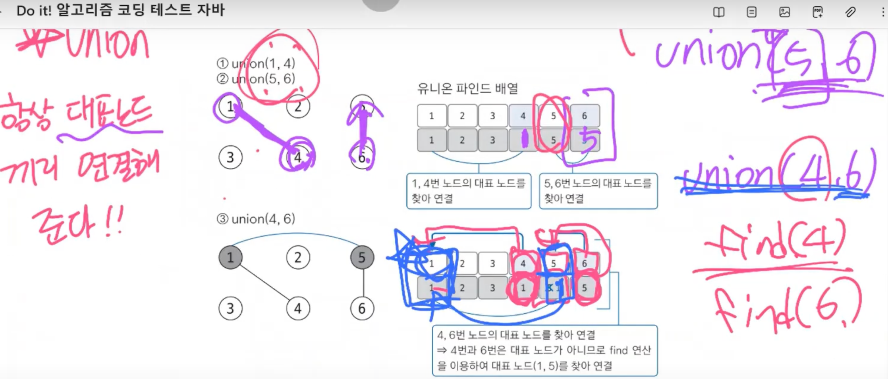

### 📌 유니온파인드

- 목적: 각각의 노드가 서로 연결되어 있는지 아닌지만 보기 위해 유니온 파인드를 쓴다.

- 여러 노드가 있을 때 특정 2개의 노드를 연결하여 1개의 집합으로 묶는 **union 연산**과 두 노드가 같은 집합에 속해 있는지 확인하는 **find 연산**으로 구성되어 있다. 

- find 연산: 자신의 대표 노드를 찾아줌
- union 연산: 항상 대표노드끼리 연결해줘야 한다!

### 📌 유니온파인드는 경로압축이다.

- 실제 그래프에서 여러 노드를 거쳐야 하는 경로에서 그래프를 변형하여 더 짧은 경로로 갈 수 있도록 만듬 -> 시간복잡도도 효과적으로 줄여짐

 

> `find 연산 작동원리`
> 1) 대상 노드 배열에 index값과 value값 동일한지 확인
> 2) 동일하지 않으면 value값이 가리키는 index위치로 이동
> 3) 이동 위치의 index값과 value값이 같을 때까지 1~2를 반복. 반복은 재귀함수로 구현
> 4) 대표 노드에 도달하면 재귀 함수로 빠져나오면서 거치는 모든 노드값을 루트 노드값(대표 노드의 value)으로 변경

 
[출처] <cite>Do it! 알고리즘 코딩테스트 자바 </cite>

 
 

### 📌 유니온 파인드에서 자주 실수하는 부분

- find 연산 시, 재귀함수에서 나오면서 탐색한 모든 노드의 대표 노드값을 이번 연산에서 발견한 대표 노드로 변경하는 부분
- union 연산 시, 선택된 노드끼리 연결이 아니라 선택된 노드의 대표 노드끼리 연결하는 부분

 
 

